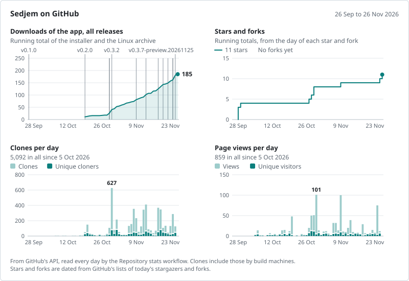
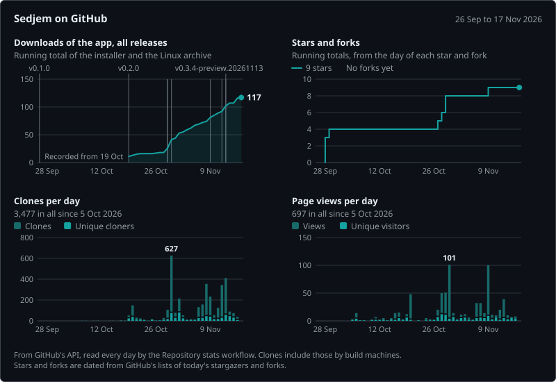

# Sedjem statistics

Updated on 2026-11-25 by the Repository stats workflow on main (`.github/workflows/stats.yml`), from GitHub's API. GitHub itself only shows the last 14 days of clones and views; this branch keeps every day since 2026-10-05.

## Totals

| | |
|---|---|
| Downloads of the app, all releases | 181 |
| Clones since 2026-10-05 | 4,966 (1,024 unique per day, added up) |
| Page views since 2026-10-05 | 847 (179 unique per day, added up) |
| Stars, forks, watchers | 9, 0, 0 |

## Downloads by release

| Release | File | Downloads |
|---|---|---|
| v0.3.7-preview.20261125 | Sedjem-0.3.7-preview.20261125-linux-x64.tar.gz | 1 |
| v0.3.7-preview.20261125 | Sedjem-0.3.7-preview.20261125-setup.exe | 1 |
| v0.3.7-preview.20261125 | SHA256SUMS.txt | 1 |
| v0.3.6 | Sedjem-0.3.6-linux-x64.tar.gz | 2 |
| v0.3.6 | Sedjem-0.3.6-setup.exe | 3 |
| v0.3.6 | SHA256SUMS.txt | 3 |
| v0.3.6-preview.20261124 | Sedjem-0.3.6-preview.20261124-linux-x64.tar.gz | 1 |
| v0.3.6-preview.20261124 | Sedjem-0.3.6-preview.20261124-setup.exe | 2 |
| v0.3.6-preview.20261124 | SHA256SUMS.txt | 2 |
| v0.3.6-preview.20261122 | Sedjem-0.3.6-preview.20261122-linux-x64.tar.gz | 1 |
| v0.3.6-preview.20261122 | Sedjem-0.3.6-preview.20261122-setup.exe | 6 |
| v0.3.6-preview.20261122 | SHA256SUMS.txt | 2 |
| v0.3.6-preview.20261120 | Sedjem-0.3.6-preview.20261120-linux-x64.tar.gz | 1 |
| v0.3.6-preview.20261120 | Sedjem-0.3.6-preview.20261120-setup.exe | 1 |
| v0.3.6-preview.20261120 | SHA256SUMS.txt | 1 |
| v0.3.5 | Sedjem-0.3.5-linux-x64.tar.gz | 4 |
| v0.3.5 | Sedjem-0.3.5-setup.exe | 30 |
| v0.3.5 | SHA256SUMS.txt | 25 |
| v0.3.4 | Sedjem-0.3.4-linux-x64.tar.gz | 7 |
| v0.3.4 | Sedjem-0.3.4-setup.exe | 14 |
| v0.3.4 | SHA256SUMS.txt | 9 |
| v0.3.3 | Sedjem-0.3.3-linux-x64.tar.gz | 1 |
| v0.3.3 | Sedjem-0.3.3-setup.exe | 20 |
| v0.3.3 | SHA256SUMS.txt | 15 |
| v0.3.2 | Sedjem-0.3.2-linux-x64.tar.gz | 6 |
| v0.3.2 | Sedjem-0.3.2-setup.exe | 20 |
| v0.3.2 | SHA256SUMS.txt | 1 |
| v0.3.1 | Sedjem-0.3.1-linux-x64.tar.gz | 1 |
| v0.3.1 | Sedjem-0.3.1-setup.exe | 9 |
| v0.3.1 | SHA256SUMS.txt | 2 |
| v0.3.0 | Sedjem-0.3.0-linux-x64.tar.gz | 1 |
| v0.3.0 | Sedjem-0.3.0-setup.exe | 2 |
| v0.3.0 | SHA256SUMS.txt | 2 |
| v0.2.0 | Sedjem-0.2.0-linux-x64.tar.gz | 1 |
| v0.2.0 | Sedjem-0.2.0-setup.exe | 8 |
| v0.2.0 | SHA256SUMS.txt | 1 |
| v0.1.0 | Sedjem-0.1.0-linux-x64.tar.gz | 4 |
| v0.1.0 | Sedjem-0.1.0-setup.exe | 14 |
| v0.1.0 | SHA256SUMS.txt | 2 |
| 10 deleted releases | the app's files | 20 |

## Last 30 days

| Day | Clones | Unique cloners | Views | Unique visitors |
|---|---|---|---|---|
| 2026-11-24 | 287 | 26 | 75 | 3 |
| 2026-11-23 | 131 | 18 | 8 | 4 |
| 2026-11-22 | 44 | 24 | 15 | 5 |
| 2026-11-21 | 134 | 38 | 7 | 3 |
| 2026-11-20 | 107 | 45 | 5 | 4 |
| 2026-11-19 | 347 | 78 | 7 | 2 |
| 2026-11-18 | 369 | 50 | 29 | 1 |
| 2026-11-17 | 70 | 6 | 4 | 4 |
| 2026-11-16 | 38 | 8 | 8 | 4 |
| 2026-11-15 | 74 | 31 | 7 | 5 |
| 2026-11-14 | 89 | 45 | 10 | 3 |
| 2026-11-13 | 411 | 59 | 39 | 5 |
| 2026-11-12 | 344 | 29 | 20 | 2 |
| 2026-11-11 | 126 | 18 | 10 | 6 |
| 2026-11-10 | 55 | 17 | 11 | 3 |
| 2026-11-09 | 233 | 41 | 100 | 9 |
| 2026-11-08 | 355 | 45 | 14 | 5 |
| 2026-11-07 | 157 | 29 | 32 | 6 |
| 2026-11-06 | 132 | 27 | 32 | 5 |
| 2026-11-05 | 15 | 9 | 2 | 2 |
| 2026-11-04 | 17 | 10 | 6 | 2 |
| 2026-11-03 | 14 | 10 | 12 | 6 |
| 2026-11-02 | 53 | 24 | 11 | 5 |
| 2026-11-01 | 215 | 80 | 3 | 2 |
| 2026-10-31 | 78 | 29 | 14 | 7 |
| 2026-10-30 | 627 | 76 | 101 | 4 |
| 2026-10-29 | 107 | 17 | 51 | 11 |
| 2026-10-28 | 28 | 8 | 50 | 12 |
| 2026-10-27 | 6 | 4 | 20 | 7 |
| 2026-10-26 | 3 | 3 | 2 | 2 |

## Where visitors came from (the 14 days to 2026-11-25)

| Site | Views | Unique visitors |
|---|---|---|
| Google | 12 | 7 |
| github.com | 8 | 4 |
| mohammedel-sayedahmed.github.io | 6 | 3 |
| m.facebook.com | 2 | 2 |
| com.linkedin.android | 1 | 1 |
| linkedin.com | 1 | 1 |

## Reading the numbers

A unique cloner or visitor is counted once a day, so someone who clones on three days counts three times in the added-up uniques.

Clones include those by build machines: every run of the Desktop build workflow clones the repository. The stats workflow does not, so it adds nothing to the counts.

A release that is deleted leaves GitHub's numbers, as each preview does once a newer one replaces it. Its files keep the last count recorded here, so the totals and the badge never fall; the table adds up the deleted releases in one row.

Stars and forks come from GitHub's lists of the current stargazers and forks, which give the day of each star and fork, so their history reaches back to the first star. A star that is taken back leaves the history altogether. stars.csv holds the running totals for each day on which they grew.

The CSV files beside this summary hold every number by day. The download, referrer and repository tables are snapshots: one set of rows per day, with GitHub's running totals at the time. The charts are drawn from these files on every run, in a light and a dark version (charts/).
